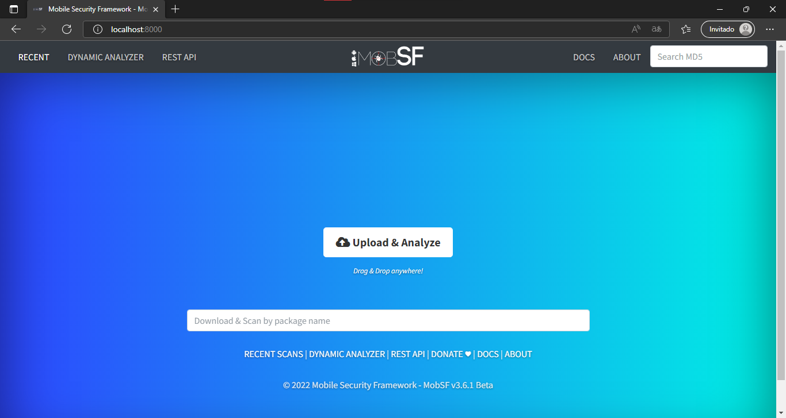

# Testing mediante MobSF (SAST)

📌 NOTA: El testing de estas aplicaciones se lo realizó utilizando Windows por lo que a continuación se indican los pasos para replicar su ejecución en este sistema operativo.

1. [Obtener Winget desde la Microsoft Store](https://www.microsoft.com/p/app-installer/9nblggh4nns1#activetab=pivot:overviewtab)

1. Instalar dependencias desde PowerShell

    IDs:
    - `Git.Git`
    - `Python.Python.3.8`
    - `Oracle.JavaRuntimeEnvironment`
    - `Oracle.JDK.19` (o 20)
    - `Microsoft.VisualStudio.2022.BuildTools`
    - `ShiningLight.OpenSSL`
    - `wkhtmltopdf.wkhtmltox`

    <br/>

    ```bash
    winget install -i <id>
    ```

1. Agregar las siguientes Variables de Entorno (buscar ruta de binarios)

    - `Python3.8`
    - `jre1.8.0`
    - `jdk-19`
    - `wkhtmltopdf`

1. Clonar el repositorio

    ```bash
    git clone https://github.com/MobSF/Mobile-Security-Framework-MobSF.git
    ```

1. Instalar MobSF

    ```bash
    cd Mobile-Security-Framework-MobSF
    ```
    ```bash
    .\setup.bat
    ```

1. Ejecutar MobSF

    ```bash
    cd Mobile-Security-Framework-MobSF
    ```
    ```bash
    .\run.bat 127.0.0.1:8000
    ```
    
1. Arrastrar el archivo APK e iniciar el Análisis

<br/>

<div align="center">

</div>

<br/>

📌 NOTA: El Análisis puede durar de 10 a 20 minutos o más.