# UNBRICK: Revivir un dispositivo móvil brickeado

<br/>

📌 Nota: Leer el tutorial hasta el final antes de realizar cualquier acción como medida precautelar.

<br/>

⚠ ADVERTENCIA: Sin garantía ninguna, este proceso se realiza para recuperar un dispositivo móvil que ha quedado inservible pero dado que estos problemas pueden llegar a ser específicos de cada dispositivo no se puede asegurar que el proceso funcione exactamente igual en todos los dispositivos.

<br/>

## Preparación

<br/>

📌 NOTA: El UNBRICK se lo realizó utilizando Windows por lo que a continuación se indican los pasos para replicar su ejecución en este sistema operativo.

1. Descargar e instalar [Git LFS (Windows)](https://git-lfs.com/)
1. Ubicarse en el repositorio desde la consola (obligatorio):

    ```bash
    cd UTPL-TT-Documentation/
    ```

1. En la consola ejecutar el siguiente comando para configurar Git LFS:

    ```bash
    git lfs install
    ```

1. Clonar nuevamente este repositorio para descargar todos los recursos necesarios

<br/>

## Instalación

1. Tener a la mano la carpeta de `0 Unbrick` con sus recursos 

    - Descargar e instalar [WinRaR](https://www.winrar.es/descargas)
    - Descomprimir las tres partes de `hotdogt_11_O.01_210120`
    - Descomprimir el resultante `hotdogt_11_O.01_210120.zip`

<br/>

1. El `Bootloader` debe estar `previamente desbloqueado` como se indicó en [(DAST)](https://github.com/da8ah/UTPL-TT-Documentation/tree/main/Seguridad/Rooting%20(DAST)#testing-en-dispositivos-m%C3%B3viles-dast)

<br/>

1. Conectar el dispositivo mediante USB y acceder al `Modo EDL` ([Emergency Download Mode](https://nitorijournal.org/es/android-es/que-es-el-modo-edl-como-ingresar-al-modo-edl-en-cualquier-dispositivo-308.html))

    **Mediante ADB** (con USB)

    ```bash
    adb devices
    ```
    ```bash
    adb reboot edl
    ```

    <br/>

    <div align="center">
    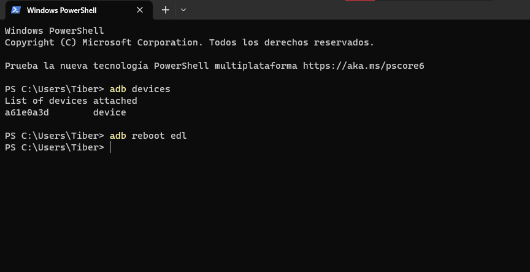
    </div>

    <br/>

    - El dispositivo se debe instalar con un mensaje similar al siguiente

    <br/>

    <div align="center">
    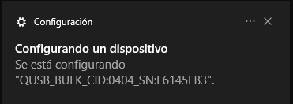
    </div>

    <br/>

    - Verificar que se ha instalado correctamente en el `Administrador de dispositivos`

    <br/>

    <div align="center">
    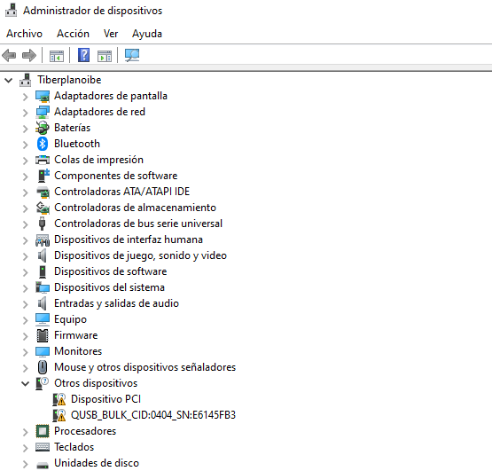
    </div>

    <br/>

1. Deshabilitar tanto el `antivirus` como el `firewall`

1. Utilizar el instalador `QDLoader HS-USB Driver_64bit_Setup.exe` para:

    - Instalar `Qualcomm Drivers` con el Wizard

        <br/>

        <div align="center">
        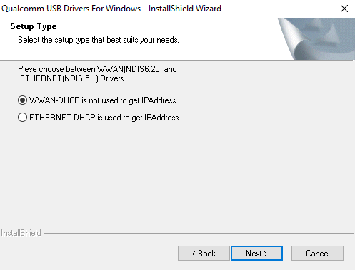
        </div>

        <br/>

        <div align="center">
        
        </div>

        <br/>

        <div align="center">
        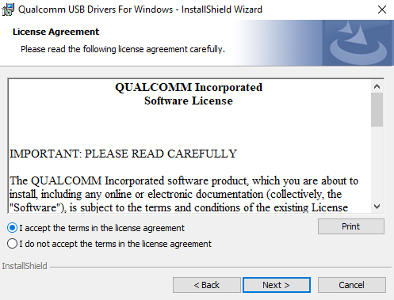
        </div>

        <br/>

        <div align="center">
        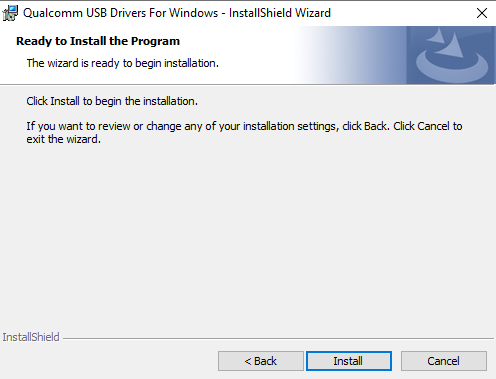
        </div>

        <br/>

        <div align="center">
        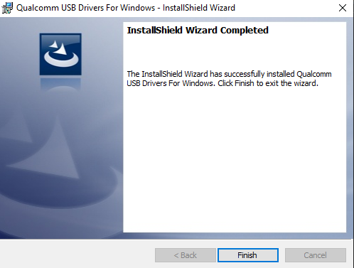
        </div>

        <br/>

    - Deshabilitar [Driver Signature Verification](https://droidwin.com/unbrick-oneplus-7-pro-7t-pro-using-msm-download-tool/#STEP_2_Disable_Windows_Driver_Signature_Verification) (`Test Mode` on/off) presionando en reiniciar el sistema (Yes)

        📌 Nota: solo aplica para Windows 8 o versiones superiores.

        <br/>

        <div align="center">
        
        </div>

        <br/>

        <div align="center">
        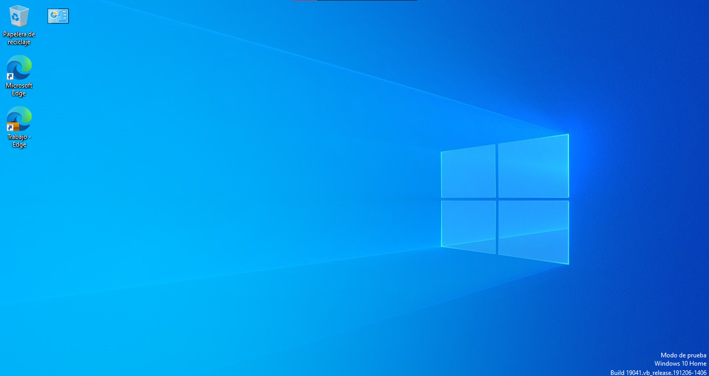
        </div>

        <br/>

    - Verificar `Test Mode` y `Qualcomm Drivers`

        - En la esquina inferior derecha debe mostrarse una Marca de agua

        <br/>

        <div align="center">
        
        </div>

        <br/>

        - En el `Administrador de dispositivos` deben listarse los Drivers

        <br/>

        <div align="center">
        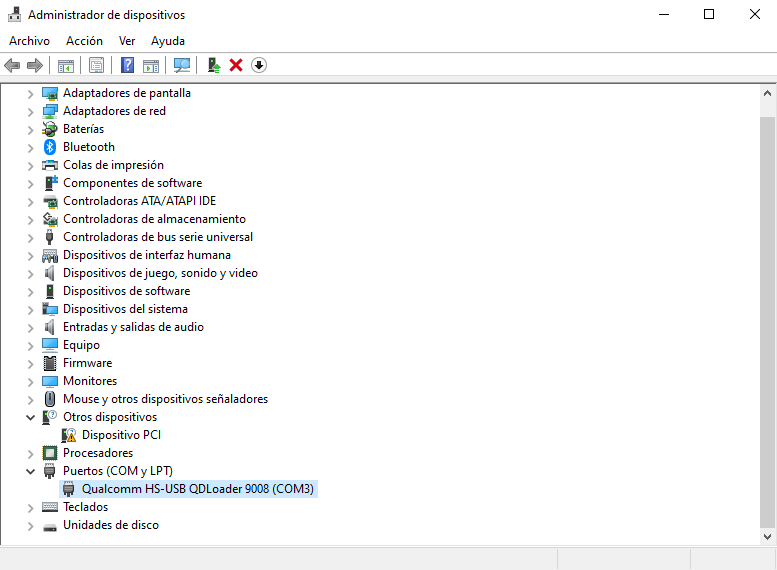
        </div>

        <br/>

## Ejecución

- En la carpeta descomprimida `hotdogt_11_O.01_210120` ejecutar `MsmDownloadTool V4.0.exe` (MSM Tool para Unbrick)
    
    <br/>

    <div align="center">
    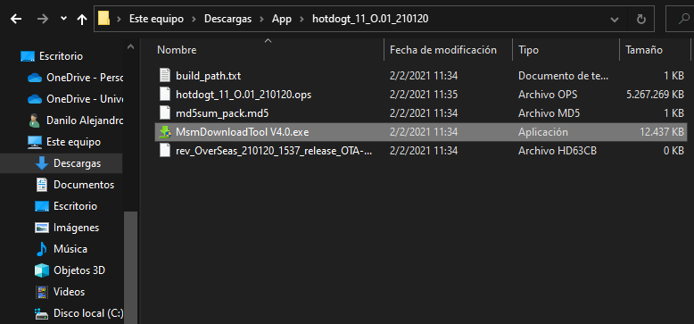
    </div>

    <br/>

- Abrir MSM Tool con el móvil **desconectado** de USB:
    
    - Dejar desmarcada opción `SHA256`
    - Cambiar `Target` a `TMO`
    - Presionar `Start` para empezar ha escuchar conexiones

    <br/>
    
- Acceder al Modo EDL **Manualmente**:

    - El dispositivo debe estar desconectado de USB
    - Apagar el dispositivo
    - Mantener ambos botones de volumen presionados
    - Con los botones presionados conectar a un [Puerto USB 2.0](https://www.thecustomdroid.com/oneplus-6-6t-unbrick-guide/#:~:text=from%20the%20PC.-,Important%20Notes%3A,-If%20you%20see) para **evitar Errores** (`Manual EDL`)
    
    <br/>

    <div align="center">
    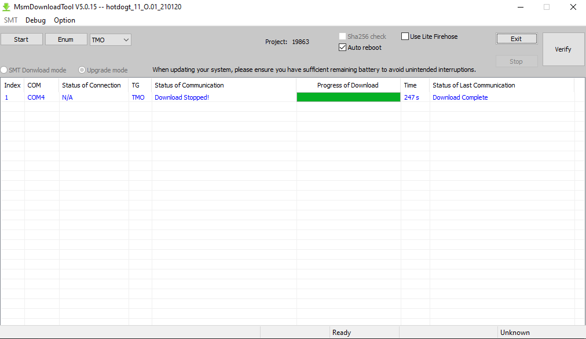
    </div>

    <br/>

## Finalización

1. Una vez finalizado desconectar el móvil y reconfigurar el sistema como estuvo:

    - Rehabilitar Driver Signature Verification (`Test Mode` off)

        - Abrir un CMD como Administrador
        ```bash
        bcdedit /set testsigning off
        ```
    
    - Habilitar `antivirus`/`firewall` nuevamente
