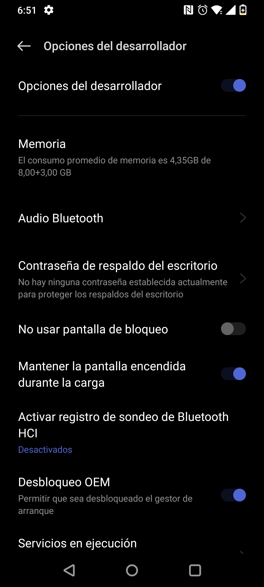
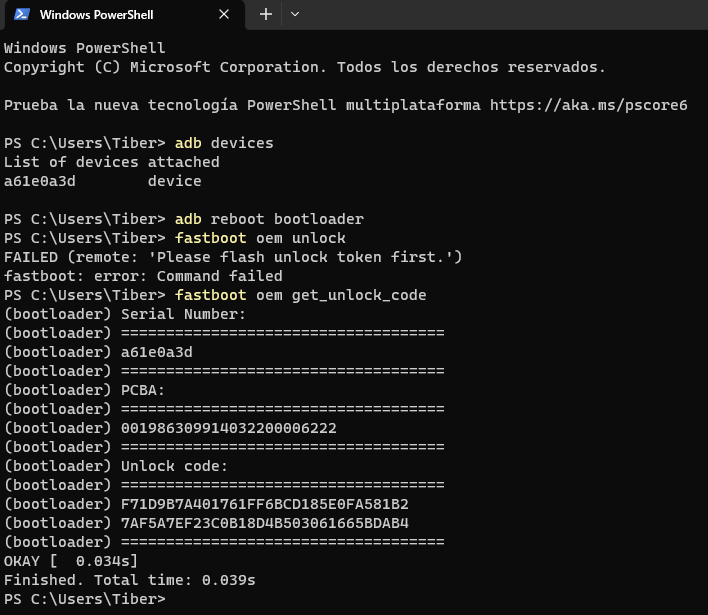

# Testing en Dispositivos Móviles (DAST)

<br/>

⚠ ADVERTENCIA: Este proceso lo realicé con la finalidad de investigación, específicamente para este Trabajo de Titulación. No me responsabilizo por ningún daño provocado al seguir este proceso. Sin embargo, si decides continuar te recomiendo utilizar los mismos recursos que comparto para minimizar posibles pérdidas aunque sin ninguna garantía.

<br/>

1. Usar un dispositivo para pruebas, en este caso [OnePlus 7T HD1907](https://a.co/d/cJ2WtwK)
1. Hacer una Copia de seguridad de los archivos y del sistema (se formateará el dispositivo reiteradas veces)
1. Desbloquear Bootloader (arranque) si está bloqueado (para evitar [full-brick](https://xdaforums.com/t/op7t-t-mobile-oos-11-0-1-5-hd63cb-unbrick-tool-to-restore-your-device-to-oxygenos.4004005/))
1. Extraer una imagen (boot.img) con [Oxygen Updater](https://oxygenupdater.com/) y [payload_dumper](https://github.com/vm03/payload_dumper.git)
1. Usar [Magisk](https://github.com/topjohnwu/Magisk/releases) para parchear la imagen
1. Usar la imagen parcheada para Flashear el dispositivo

<br/>

## Preparación

📌 NOTA: El testing de estas aplicaciones se lo realizó utilizando Windows por lo que a continuación se indican los pasos para replicar su ejecución en este sistema operativo.

1. Contar con el dispositivo y haber respaldado tanto el sistema como la información

1. [Obtener Winget desde la Microsoft Store](https://www.microsoft.com/p/app-installer/9nblggh4nns1#activetab=pivot:overviewtab)

1. Instalar dependencias desde PowerShell

    IDs:
    - `Google.PlatformTools`

    <br/>

    ```bash
    winget install <id>
    ```

1. Instalar [Drivers de OnePlus](https://oneplusdriver.com/download-oneplus-driver#download)

1. Agregar las siguientes Variables de Entorno

    - `Google.PlatformTools` (buscar ruta de binarios)
    - `C:\Program Files (x86)\OnePlus USB Drivers\Android`

    <br/>

## Desbloquear bootloader (conectar móvil por USB)

1. Conectar el móvil por USB a la computadora
1. Activar el Modo desarrollador en el dispositivo

    - Presionar 7 veces en "Versión de software"

    <br/>

    <div align="center" style="width:100%;display:flex;flex-direction:row;justify-content:space-evenly;align-items:flex-start;">
    
    
    
    
    </div>

    <br/>

1. En Opciones del desarrollador habilitar:

    - Mantener la pantalla encendida durante la carga
    - Desbloqueo OEM (Activar)

    <br/>

    <div align="center" style="width:100%;display:flex;flex-direction:row;justify-content:space-evenly;align-items:flex-start;">
    
    
    
    
    </div>

    <br/>

    - Depuración de USB > (Aceptar) > (PERMITIR siempre desde esta computadora)
    - Desactivar tiempo límite de autorización de ADB (opcional)

    <br/>

    <div align="center" style="width:100%;display:flex;flex-direction:row;justify-content:space-evenly;align-items:flex-start;">
    
    
    
    </div>

    <br/>

1. Configurar Fastboot Driver

    - Con el dispositivo conectado por USB acceder al bootloader mediante ADB

        ```bash
        adb devices
        ```
        ```bash
        adb reboot bootloader
        ```

        <br/>

        <div align="center">
        
        </div>

        <br/>

    - Administrador de dispositivos > Dispositivos portátiles > Otros dispositivos
    - Elegir en una lista de controladores disponibles en el equipo

        <br/>

        <div align="center">
        
        </div>

        <br/>

        <div align="center">
        
        </div>

        <br/>

        <div align="center">
        
        </div>

        <br/>

        <div align="center">
        
        </div>

        <br/>

    - (Usar disco...): 1 Unlock bootloader > Fastboot Driver > android_winusb.inf

        <br/>

        <div align="center">
        
        </div>

        <br/>

        <div align="center">
        
        </div>

        <br/>

        <div align="center">
        
        </div>

        <br/>
    
    - Asegurarse de que estén listados: ADB Interface, Bootloader y Composite

        <br/>

        <div align="center">
        
        </div>

        <br/>

        <div align="center">
        
        </div>

        <br/>

        <div align="center">
        
        </div>

        <br/>

        <div align="center">
        
        </div>

        <br/>

    - Al finalizar asegurarse de que se muestre: Android Device > Android ADB Interface

    <br/>

1. Desbloquear dispositivo (Bootloader)

    El bootloader del dispositivo por defecto viene bloqueado. Se debe seguir el proceso para desbloquearlo que se explica a continuación:

    - Verificar mediante el Modo EDL si el bootloader está bloqueado (locked) de lo contrario saltar este paso hasta el final.
        
        **Manualmente**

        - Apagar el dispositivo
        - Mantener ambos botones de volumen presionados
        - Encender dispositivo manteniendo los botones

        <br/>

        <div align="center">
        
        </div>

        <br/>

        **Mediante ADB**

        ```bash
        adb devices
        ```
        ```bash
        adb reboot edl
        ```

        <br/>

        <div align="center">
        
        </div>

        <br/>

    - Obtener el código de desbloqueo

        <br/>

        <div align="center">
        
        </div>

        <br/>

        - Acceder al bootloader mediante ADB
        
        ```bash
        adb devices
        ```
        ```bash
        adb reboot bootloader
        ```
        
        - Una vez en el bootloader, al ejecutar el siguiente comando debe presentar un error (FAILED: ... token ...)

        ```bash
        fastboot oem unlock
        ```
        
        - El error anterior significa que necesitamos un código de desbloqueo, se obtiene mediante el comando

        ```bash
        fastboot oem get_unlock_code
        ```
