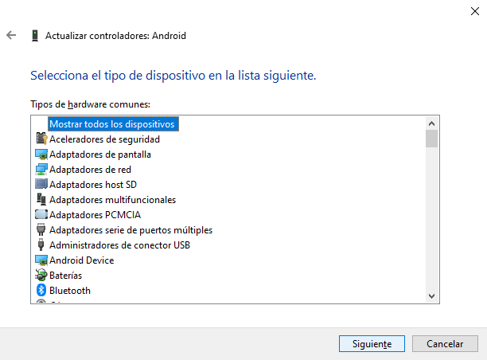
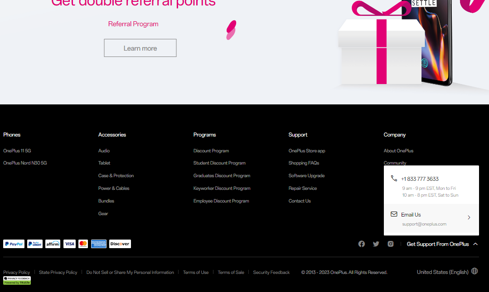
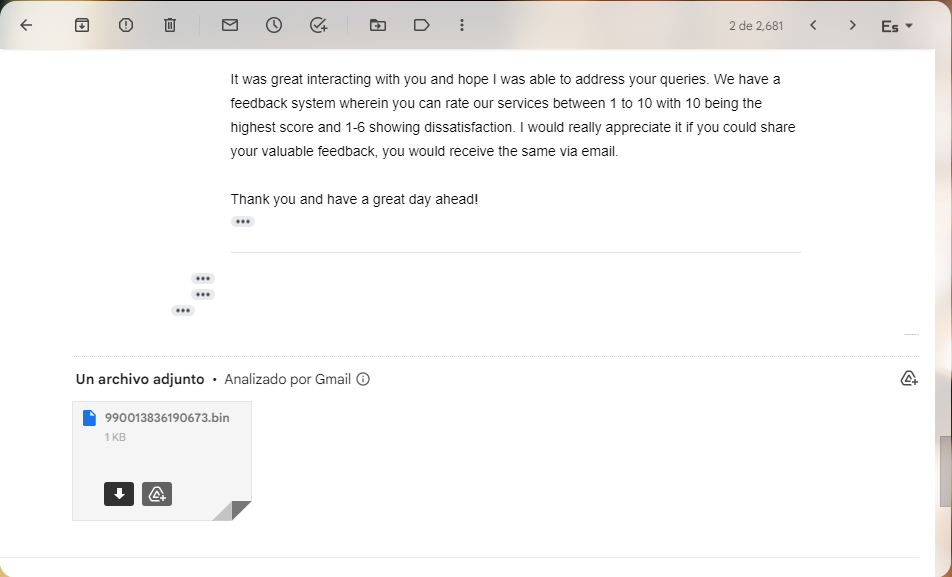

# Testing en Dispositivos Móviles (DAST)

<br/>

⚠ ADVERTENCIA: Este proceso lo realicé con la finalidad de investigación, específicamente para este Trabajo de Titulación. No me responsabilizo por ningún daño provocado al seguir este proceso. Sin embargo, si decides continuar te recomiendo utilizar los mismos recursos que comparto para minimizar posibles pérdidas aunque sin ninguna garantía.

<br/>

1. Usar un dispositivo para pruebas, en este caso [OnePlus 7T HD1907](https://a.co/d/cJ2WtwK)
1. Hacer una Copia de seguridad de los archivos y del sistema (se formateará el dispositivo reiteradas veces)
1. Desbloquear Bootloader (arranque) si está bloqueado (para evitar [full-brick](https://xdaforums.com/t/op7t-t-mobile-oos-11-0-1-5-hd63cb-unbrick-tool-to-restore-your-device-to-oxygenos.4004005/))
1. Extraer una imagen (boot.img) con [Oxygen Updater](https://oxygenupdater.com/) y [payload_dumper](https://github.com/vm03/payload_dumper.git)
1. Usar [Magisk](https://github.com/topjohnwu/Magisk/releases) para parchear la imagen
1. Usar la imagen parcheada para Flashear el dispositivo

<br/>

## Preparación

📌 NOTA: El testing de estas aplicaciones se lo realizó utilizando Windows por lo que a continuación se indican los pasos para replicar su ejecución en este sistema operativo.

1. Contar con el dispositivo y haber respaldado tanto el sistema como la información

1. [Obtener Winget desde la Microsoft Store](https://www.microsoft.com/p/app-installer/9nblggh4nns1#activetab=pivot:overviewtab)

1. Instalar dependencias desde PowerShell

    IDs:
    - `Google.PlatformTools`

    <br/>

    ```bash
    winget install <id>
    ```

1. Instalar [Drivers de OnePlus](https://oneplusdriver.com/download-oneplus-driver#download)

1. Agregar las siguientes Variables de Entorno

    - `Google.PlatformTools` (buscar ruta de binarios)
    - `C:\Program Files (x86)\OnePlus USB Drivers\Android`

    <br/>

## Desbloquear bootloader (conectar móvil por USB)

### 1. Conectar el móvil por USB a la computadora

- Asegurarse de habilitar la opción de transferencia de archivos

### 2. Activar el Modo desarrollador en el dispositivo

- Presionar 7 veces en "Versión de software"

<br/>

<div align="center" style="width:100%;display:flex;flex-direction:row;justify-content:space-evenly;align-items:flex-start;">


</div>

<br/>

### 3. En Opciones del desarrollador habilitar:

- Mantener la pantalla encendida durante la carga
- Desbloqueo OEM (Activar)

<br/>

<div align="center" style="width:100%;display:flex;flex-direction:row;justify-content:space-evenly;align-items:flex-start;">


</div>

<br/>

- Depuración de USB > (Aceptar) > (PERMITIR siempre desde esta computadora)
- Desactivar tiempo límite de autorización de ADB (opcional)

<br/>

<div align="center" style="width:100%;display:flex;flex-direction:row;justify-content:space-evenly;align-items:flex-start;">


</div>

<br/>

### 4. Acceder al Bootloader del dispositivo (Si DEVICE STATE es unlocked saltar todo el proceso)

El bootloader del dispositivo por defecto viene bloqueado.

<br/>

**Manualmente**

- Apagar el dispositivo
- Mantener ambos botones de volumen presionados
- Encender dispositivo manteniendo los botones
- Verificar al final DEVICE STATE (locked/unlocked)

<br/>

<div align="center">

</div>

<br/>

**Mediante ADB**

```bash
adb devices
```
```bash
adb reboot bootloader
```

<br/>

<div align="center">

</div>

<br/>

### 5. Configurar Fastboot Driver

- Con el dispositivo conectado por USB acceder al bootloader mediante ADB (Ver paso anterior)
- Administrador de dispositivos > Dispositivos portátiles > Otros dispositivos
- Elegir en una lista de controladores disponibles en el equipo

    <br/>

    <div align="center">
    
    </div>

    <br/>

    <div align="center">
    
    </div>

    <br/>

    <div align="center">
    
    </div>

    <br/>

    <div align="center">
    
    </div>

    <br/>

- (Usar disco...): 1 Unlock bootloader > Fastboot Driver > android_winusb.inf

    <br/>

    <div align="center">
    
    </div>

    <br/>

    <div align="center">
    
    </div>

    <br/>

    <div align="center">
    
    </div>

    <br/>

- Asegurarse de que estén listados: ADB Interface, Bootloader y Composite

    <br/>

    <div align="center">
    
    </div>

    <br/>

    <div align="center">
    
    </div>

    <br/>

    <div align="center">
    
    </div>

    <br/>

    <div align="center">
    
    </div>

    <br/>

- Al finalizar asegurarse de que se muestre: Android Device > Android ADB Interface

<br/>

### 6. Código y Token de desbloqueo

#### Obtener el código de desbloqueo

<br/>

<div align="center">

</div>

<br/>

- Acceder al bootloader mediante ADB

    ```bash
    adb devices
    ```
    ```bash
    adb reboot bootloader
    ```

- Una vez en el bootloader, al ejecutar el siguiente comando debe presentar un error (FAILED: ... token ...)

    ```bash
    fastboot oem unlock
    ```

- El error anterior significa que necesitamos un código de desbloqueo, se obtiene mediante el comando

    ```bash
    fastboot oem get_unlock_code
    ```

<br/>
    
#### Obtener un token de desbloqueo

- Crear una cuenta en el sitio web de [OnePlus](https://www.oneplus.com/us/unlock_token)
- Iniciar sesión y crear una solicitud [Unlock Your Device](https://www.oneplus.com/us/unlock_token)
- Completar la información como se muestra a continuación

<br/>

<div align="center">

</div>

<br/>

- Enviar y revisar que la orden se haya generado en "Check my applications"

<br/>

<div align="center">

</div>

<br/>

- Esperar un día y luego en la parte inferior de la web presionar en "Get Support From OnePlus", para usar uno de los dos métodos que se explican debajo:

    <br/>

    <div align="center">
    
    </div>

    <br/>
    
    - (NO usé este método) Puedes presionar en el enlace de [Ask](https://oneplus.custhelp.com/app/ask) que te llevará a un formulario, o

    <br/>

    <div align="center">
    
    </div>

    <br/>

    - (Recomendación personal) Puedes utilizar el correo electrónico de [soporte](mailto:support@oneplus.com) para redactar un mensaje similar al siguiente

        <br/>

        - Name: cambiar Tiber por tu nombre
        - Invoice: adjuntar captura de la compra del dispositivo
        - IMEI: en el móvil ir a llamadas y marcar al número *#06#
        - PCBD: en el móvil ir a llamadas y marcar al número *#888#
        - Unlock code: utilizar el [código del paso anterior](#6-código-y-token-de-desbloqueo) con el comando `fastboot oem get_unlock_code`
        - sn: Serial Number, obtener del mismo comando `fastboot oem get_unlock_code`
        - os: Operating System, ver la versión de Android del dispositivo en: 
            
            Configuración > Acerca del dispositivo > Versión de Android

        <br/>

        En las imágenes se muestra toda la conversación pero he redactado un solo mensaje para mayor facilidad.

        ```bash
        Hi,

        I'm (name) Tiber, I sent a request to unlock my device. Can anyone help me please?

        - The request it's for unlocking the bootloader of my phone.
        - I'm currently in Latin America, Ecuador.  

        1. Invoice copy/ Proof of purchase of the device
        
            (paste invoice)

        2. If it is a TMO purchase, please confirm whether the installment payment contract is completed. 
        I suppose it's not a TMO purchase but I'm not so sure about this one.

        3. We would like to know whether you are currently using a TMO SIM card. Please confirm whether the contract for the SIM card plan has been completed.
        I'm not using a TMO SIM Card

        4. IMEI number(dial *#06#) of the device 
        990013836190673

        5. 24 digits PCBA(dial *#888# to find it)
        001986309914032200006222

        6. 64 digits unlock code
        F71D9B7A401761FF6BCD185E0FA581B2
        7AF5A7EF23C0B18D4B503061665BDAB4

        sn: a61e0a3d
        os: Android 12

        I'm using the phone for investigation in mobile security so I need to unlock it. If you could give me a hand, I'd appreciate it.
        Thank you!
        ```

        <br/>

        <div align="center">
        
        </div>

        <br/>

        <div align="center">
        
        </div>

        <br/>

        <div align="center">
        
        </div>

        <br/>

        <div align="center">
        
        </div>

        <br/>

        <div align="center">
        
        </div>

        <br/>

        <div align="center">
        
        </div>

        <br/>

        - Al final del intercambio de mensajes me enviaron el archivo con el token (.bin). El token es específico de cada dispositivo móvil por lo que debe ser guardado con cuidado.

        <br/>

### 7. Flasheo de Bootloader con Token

- Mover el token `.bin` a la carpeta del usuario `C:\Users\<usuario>` (reemplazar con tu usuario), en donde se encuentra la carpeta `.fastboot`

<br/>

<div align="center">

</div>

<br/>

- De lo contrario el archivo no será encontrado y se mostrará un `Error: ANDROID_PRODUCT_OUT`

<br/>

<div align="center">

</div>

<br/>

- Conectar el dispositivo mediante USB y repetir el paso para ingresar al Bootloader

**Mediante ADB**

```bash
adb devices
```
```bash
adb reboot bootloader
```

<br/>

<div align="center">

</div>

<br/>
<br/>

- Reemplazar `<file>` con el token y ejecutar los comandos para desbloqueo del Bootloader

```bash
fastboot flash cust-unlock <file>.bin
```
```bash
flashboot oem unlock
```

<br/>

- En el dispositivo móvil confirmar el desploqueo del Bootloader: `UNLOCK THE BOOLOADER`

<br/>

<div align="center">

</div>

<br/>

<div align="center" style="width:100%;display:flex;flex-direction:row;justify-content:space-evenly;align-items:center;">


</div>

<br/>

<div align="center">

</div>

<br/>